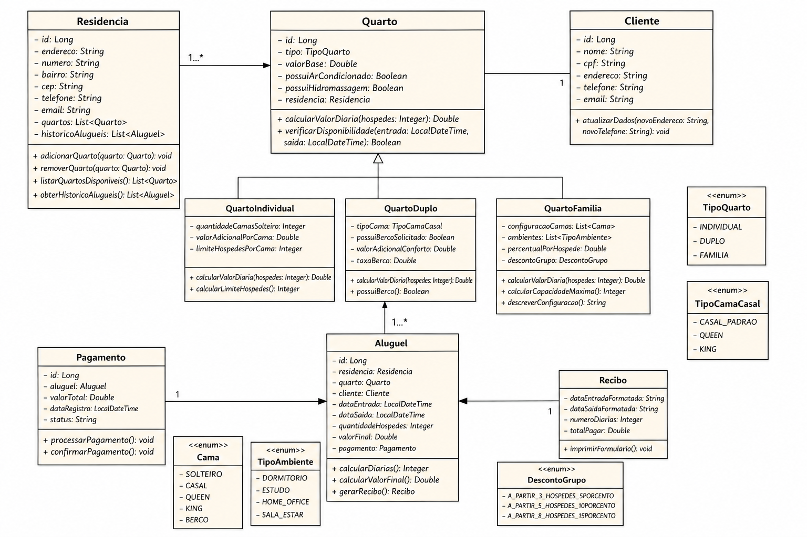

# Sistema de Hospedagem - API REST

## 📖 Sobre o Projeto
Este projeto é um Sistema de Informação Modular desenvolvido como trabalho prático para a disciplina de Programação Modular. O objetivo é fornecer uma solução eficiente e escalável para o gerenciamento de hospedagens em residências locais na região de Maraú - BA. 

O sistema permite o gerenciamento de residências, quartos, clientes e aluguéis, além de realizar cálculos automáticos de diárias e emissão de recibos, utilizando conceitos avançados de Programação Orientada a Objetos (POO).

## 🚀 Tecnologias e Arquitetura
O projeto foi estruturado utilizando o padrão de arquitetura em camadas (Controller, Service, Repository, Model) para garantir o desacoplamento e a manutenibilidade do código.

* **Linguagem:** Java
* **Framework:** Spring Boot (API REST)
* **Banco de Dados:** MySQL
* **Boas Práticas:** Programação Orientada a Objetos (POO), Padrões de Projeto, Testes Automatizados.

## 👥 Equipe
* Ítalo Eduardo Carneiro da Silva
* Guilherme Augusto Martins de Carvalho
* Luca Moreira Ribeiro Mazala de Araujo
* João Victor Leite Soares

---

## 📇 Cartões CRC (Classe - Responsabilidade - Colaboração)

Abaixo estão detalhados os cartões CRC que guiaram a modelagem orientada a objetos do sistema, divididos por casos de uso.

### 1. Caso de Uso: Gerenciar Residências e Quartos

| Classe: Residencia | |
| :--- | :--- |
| **Responsabilidades** | **Colaborações** |
| 1. Conhecer seu endereço, número, bairro, cep, telefone e email | |
| 2. Conhecer e gerenciar sua lista de quartos que podem ser alugados | Quarto |
| 3. Guardar e fornecer o histórico de aluguéis realizados na residência | Aluguel |

 

| Classe: Quarto | |
| :--- | :--- |
| **Responsabilidades** | **Colaborações** |
| 1. Conhecer suas características, valor base, itens adicionais e a residência a qual pertence | Residencia |
| 2. Calcular o valor da sua diária de acordo com as regras do tipo do quarto e quantidade de hóspedes | |
| 3. Verificar e informar sua disponibilidade para garantir que não haja conflitos | Aluguel |

### 2. Caso de Uso: Cadastro e Autenticação de Clientes

| Classe: Cliente | |
| :--- | :--- |
| **Responsabilidades** | **Colaborações** |
| 1. Conhecer o seu nome e CPF | |
| 2. Conhecer o seu endereço | |
| 3. Conhecer os seus dados de contato, como telefone e email | |
| 4. Atualizar seus dados cadastrais (endereço e telefone) | |

### 3. Caso de Uso: Realização de Reservas e Aluguéis

| Classe: Aluguel | |
| :--- | :--- |
| **Responsabilidades** | **Colaborações** |
| 1. Conhecer a data e o horário de entrada, saída e quantidade de hóspedes | |
| 2. Conhecer e associar-se à residência, ao quarto e ao cliente | Residencia, Quarto, Cliente |
| 3. Calcular a quantidade de diárias, considerando regras de check-in e check-out | |
| 4. Calcular o valor final da hospedagem solicitando o valor da diária para o quarto | Quarto |
| 5. Gerar o recibo do aluguel | Recibo |
| 6. Estar associado a um pagamento para quitação dos valores | Pagamento |

 

| Classe: Pagamento | |
| :--- | :--- |
| **Responsabilidades** | **Colaborações** |
| 1. Conhecer seu status, data de registro e o valor total a ser cobrado | |
| 2. Processar e confirmar a transação financeira vinculada a um aluguel | Aluguel |

### 4. Caso de Uso: Emissão de Recibos

| Classe: Recibo | |
| :--- | :--- |
| **Responsabilidades** | **Colaborações** |
| 1. Coletar e formatar a data e horário de entrada e saída | Aluguel |
| 2. Coletar e formatar o número total de diárias | |
| 3. Obter o valor total a pagar gerado pelo aluguel | |
| 4. Imprimir essas informações formatadas na tela | |

---

## 📊 Diagramas de Classe (UML - Domain Models)

Abaixo estão as representações das entidades principais que compõem a camada `Model` do sistema.

---------------------------------------------------------
|                      Residencia                       |
---------------------------------------------------------
| - id: Long                                            |
| - endereco: String                                    |
| - numero: String                                      |
| - bairro: String                                      |
| - cep: String                                         |
| - telefone: String                                    |
| - email: String                                       |
| - quartos: List<Quarto>                               |
| - historicoAlugueis: List<Aluguel>                    |
---------------------------------------------------------
| + adicionarQuarto(quarto: Quarto): void               |
| + removerQuarto(quarto: Quarto): void                 |
| + listarQuartosDisponiveis(): List<Quarto>            |
| + obterHistoricoAlugueis(): List<Aluguel>             |
---------------------------------------------------------

---------------------------------------------------------
|                        Quarto (ABSTRACT)              |
---------------------------------------------------------
| - id: Long                                            |
| - valorBase: Double                                   |
| - possuiArCondicionado: Boolean                       |
| - possuiHidromassagem: Boolean                        |
| - residencia: Residencia                              |
---------------------------------------------------------
| + calcularValorDiaria(hospedes: Integer): Double      |
| + verificarDisponibilidade(entrada: LocalDateTime,    |
|                            saida: LocalDateTime):     |
|                            Boolean                    |
---------------------------------------------------------

---------------------- HERANÇA --------------------------

---------------------------------------------------------
|                   QuartoIndividual                    |
---------------------------------------------------------
| - quantidadeCamasSolteiro: Integer                    |
| - valorAdicionalPorCama: Double                       |
---------------------------------------------------------
| + calcularValorDiaria(hospedes: Integer): Double      |
| + calcularLimiteHospedes(): Integer                   |
---------------------------------------------------------

REGRAS:
- Não permite berço
- Valor = valorBase + adicional por cama (se >1 cama)
- Limite de hóspedes proporcional às camas

---------------------------------------------------------
|                      QuartoDuplo                      |
---------------------------------------------------------
| - tipoCama: TipoCamaCasal                             |
| - possuiBercoSolicitado: Boolean                      |
| - valorAdicionalConforto: Double                      |
| - taxaBerco: Double                                   |
---------------------------------------------------------
| + calcularValorDiaria(hospedes: Integer): Double      |
| + possuiBerco(): Boolean                              |
---------------------------------------------------------

REGRAS:
- Pode ter cama casal, queen ou king
- Berço é opcional (sob solicitação)
- Taxa extra se solicitar berço
- Adicional por tipo de cama

---------------------------------------------------------
|                     QuartoFamilia                     |
---------------------------------------------------------
| - configuracaoCamas: List<Cama>                       |
| - ambientes: List<TipoAmbiente>                       |
| - percentualPorHospede: Double                        |
| - descontoGrupo: DescontoGrupo                        |
---------------------------------------------------------
| + calcularValorDiaria(hospedes: Integer): Double      |
| + calcularCapacidadeMaxima(): Integer                 |
| + descreverConfiguracao(): String                     |
---------------------------------------------------------

REGRAS:
- Mistura de camas (solteiro, casal, etc)
- Cálculo baseado em número de hóspedes
- Valor = valorBase + (% * número de hóspedes)
- Desconto progressivo para grupos

---------------------- ENUMS ----------------------------

---------------------------------------------------------
|                    <<enum>> TipoQuarto                |
---------------------------------------------------------
| INDIVIDUAL                                           |
| DUPLO                                                |
| FAMILIA                                              |
---------------------------------------------------------

---------------------------------------------------------
|                 <<enum>> TipoCamaCasal                |
---------------------------------------------------------
| CASAL_PADRAO                                         |
| QUEEN                                                |
| KING                                                 |
---------------------------------------------------------

---------------------------------------------------------
|                      <<enum>> Cama                    |
---------------------------------------------------------
| SOLTEIRO                                             |
| CASAL                                                |
| QUEEN                                                |
| KING                                                 |
| BERCO                                                |
---------------------------------------------------------

---------------------------------------------------------
|                 <<enum>> TipoAmbiente                 |
---------------------------------------------------------
| DORMITORIO                                           |
| ESTUDO                                               |
| HOME_OFFICE                                          |
| SALA_ESTAR                                           |
---------------------------------------------------------

---------------------------------------------------------
|                <<enum>> DescontoGrupo                 |
---------------------------------------------------------
| A_PARTIR_3_HOSPEDES_5PORCENTO                        |
| A_PARTIR_5_HOSPEDES_10PORCENTO                       |
| A_PARTIR_8_HOSPEDES_15PORCENTO                       |
---------------------------------------------------------

---------------------------------------------------------
|                       Cliente                         |
---------------------------------------------------------
| - id: Long                                            |
| - nome: String                                        |
| - cpf: String                                         |
| - endereco: String                                    |
| - telefone: String                                    |
| - email: String                                       |
---------------------------------------------------------
| + atualizarDados(novoEndereco: String,                |
|                  novoTelefone: String): void          |
---------------------------------------------------------

---------------------------------------------------------
|                       Aluguel                         |
---------------------------------------------------------
| - id: Long                                            |
| - residencia: Residencia                              |
| - quarto: Quarto                                      |
| - cliente: Cliente                                    |
| - dataEntrada: LocalDateTime                          |
| - dataSaida: LocalDateTime                            |
| - quantidadeHospedes: Integer                         |
| - valorFinal: Double                                  |
| - pagamento: Pagamento                                |
---------------------------------------------------------
| + calcularDiarias(): Integer                          |
| + calcularValorFinal(): Double                        |
| + gerarRecibo(): Recibo                               |
---------------------------------------------------------

---------------------------------------------------------
|                      Pagamento                        |
---------------------------------------------------------
| - id: Long                                            |
| - aluguel: Aluguel                                    |
| - valorTotal: Double                                  |
| - dataRegistro: LocalDateTime                         |
| - status: String                                      |
---------------------------------------------------------
| + processarPagamento(): void                          |
| + confirmarPagamento(): void                          |
---------------------------------------------------------

---------------------------------------------------------
|                        Recibo                         |
---------------------------------------------------------
| - dataEntradaFormatada: String                        |
| - dataSaidaFormatada: String                          |
| - numeroDiarias: Integer                              |
| - totalPagar: Double                                  |
---------------------------------------------------------
| + imprimirFormulario(): void                          |
---------------------------------------------------------
