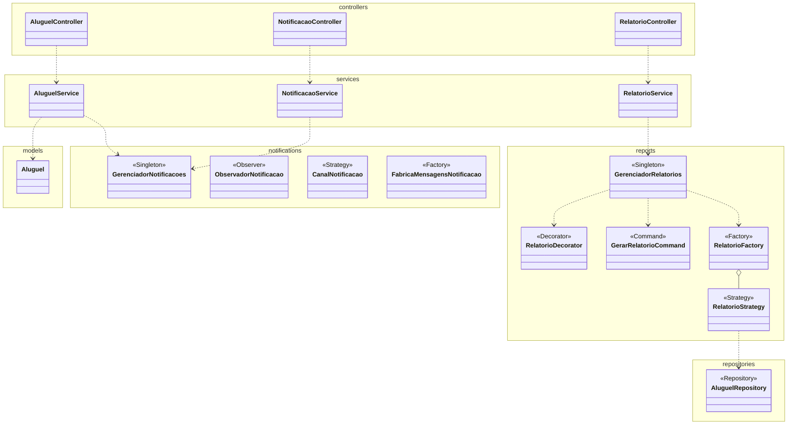
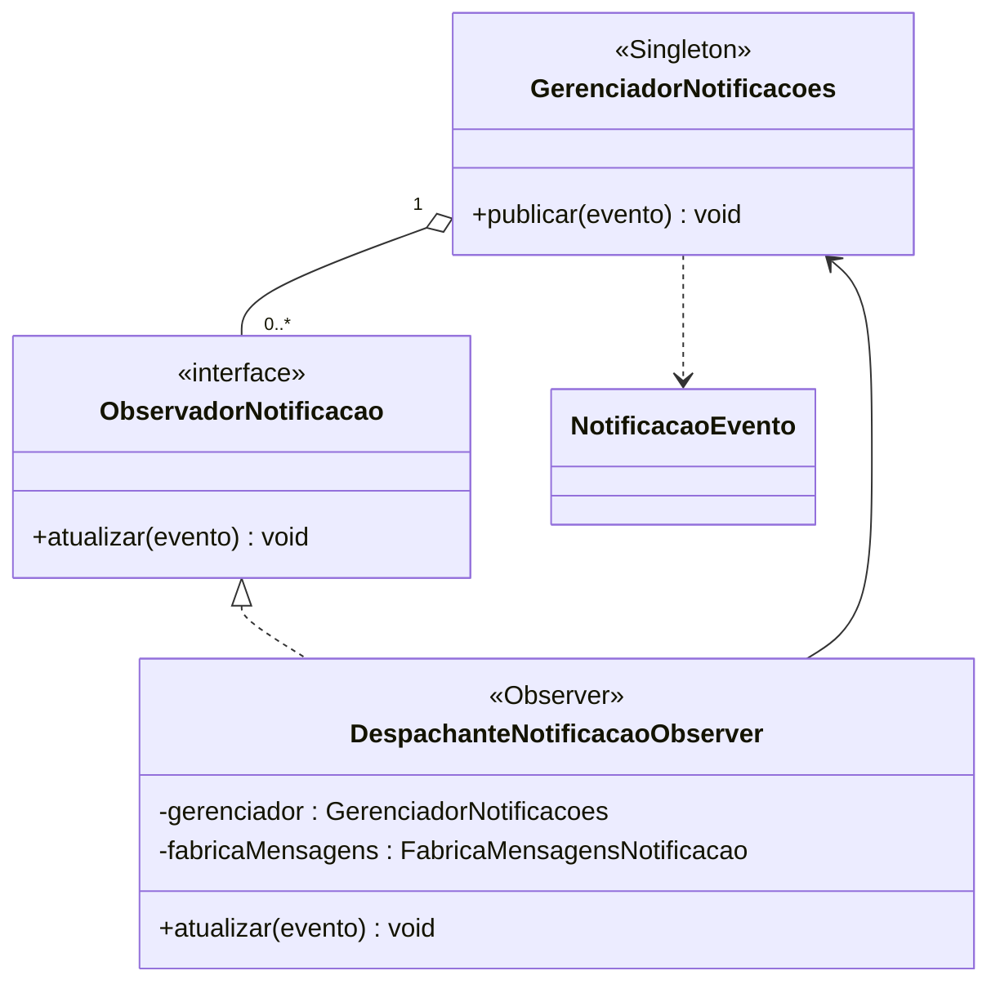
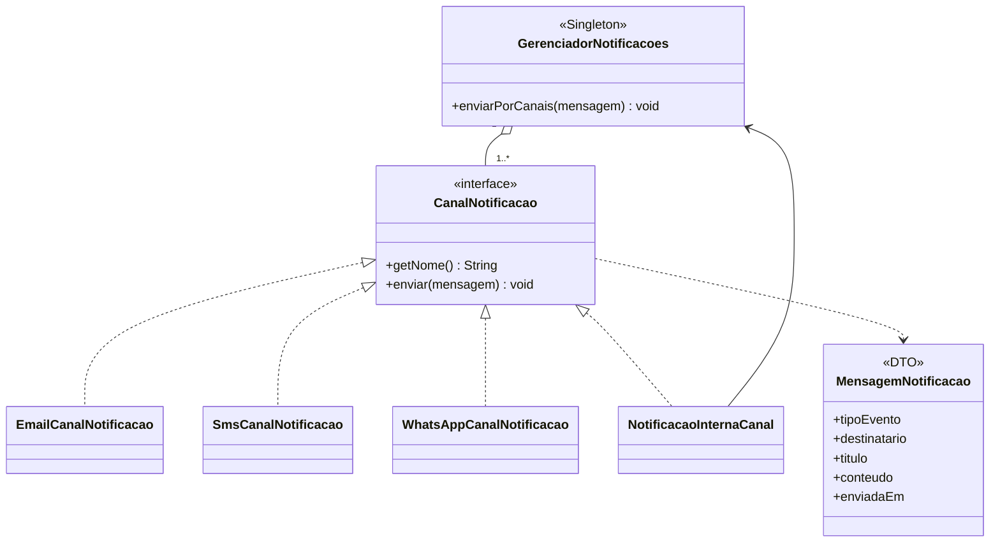
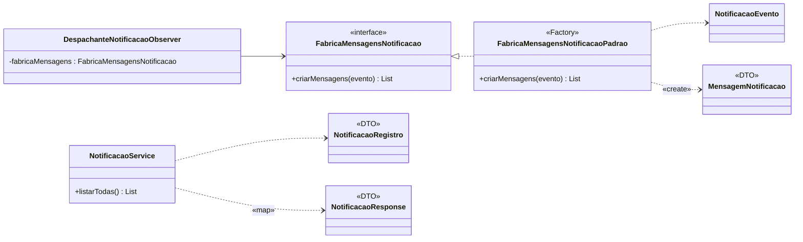
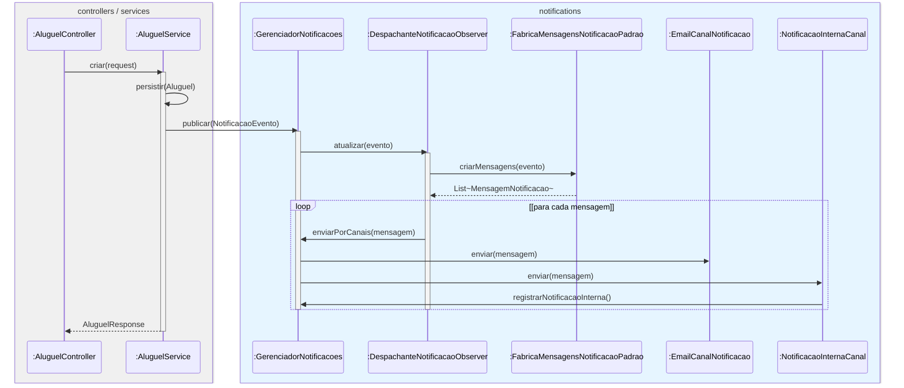
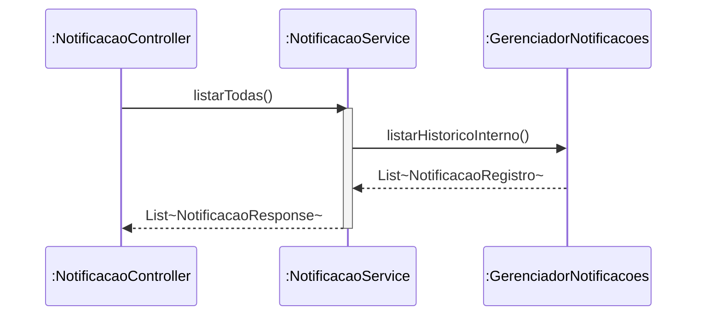
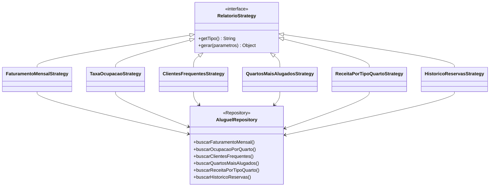
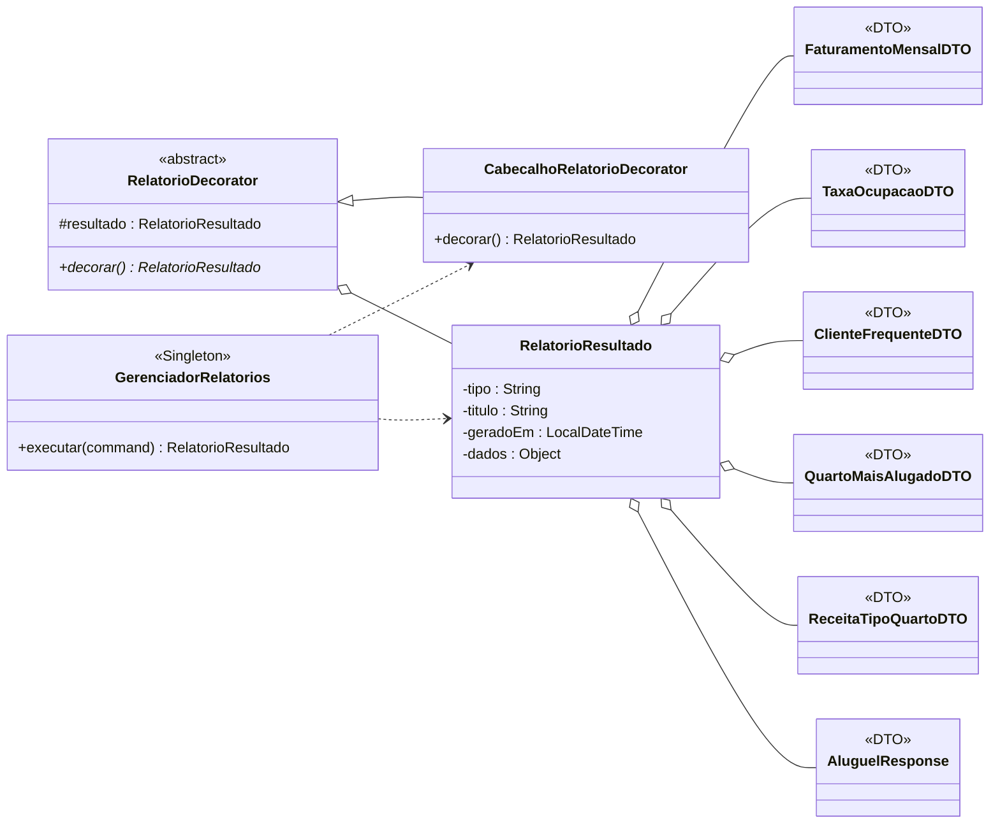
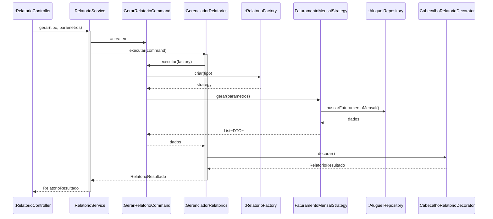
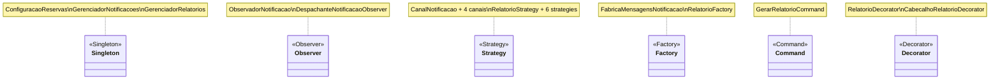

# Sprint 4 — Diagramas UML

Complemento de [sprint4-relatorio.md](sprint4-relatorio.md). Notação UML 2.x em Mermaid.

**Legenda de relações**

| Símbolo | Significado UML |
|---------|-----------------|
| `--\|>` | generalização (herança / realização) |
| `*--` | composição |
| `o--` | agregação |
| `-->` | associação |
| `..>` | dependência |
| `1`, `0..1`, `1..*` | multiplicidade |

---

## 1. Diagrama de pacotes — visão geral



---

## 2. Opção 3 — Central de Notificações

### 2.1 Estrutural — núcleo e integração

```mermaid
classDiagram
    direction LR

    class AluguelService {
        -gerenciadorNotificacoes : GerenciadorNotificacoes
        +criar() AluguelResponse
        +cancelar() void
        +realizarCheckIn() AluguelResponse
        +realizarCheckOut() AluguelResponse
        +confirmarPagamento() AluguelResponse
        -publicarEvento() void
    }

    class NotificacaoController {
        +listar() List
        +listarPorEvento() List
    }

    class NotificacaoService {
        -gerenciador : GerenciadorNotificacoes
        +listarTodas() List
        +listarPorEvento() List
    }

    class NotificacaoConfig {
        +inicializarCentralNotificacoes() void
    }

    class GerenciadorNotificacoes <<Singleton>> {
        -instancia {static} : GerenciadorNotificacoes
        -observadores : List
        -canais : List
        -historicoInterno : List
        +getInstance() {static} GerenciadorNotificacoes
        +registrarObservador() void
        +registrarCanal() void
        +publicar() void
        +enviarPorCanais() void
        +registrarNotificacaoInterna() void
        +listarHistoricoInterno() List
        +listarPorEvento() List
    }

    class NotificacaoEvento {
        -tipo : TipoEventoNotificacao
        -aluguel : Aluguel
        -ocorridoEm : LocalDateTime
    }

    class TipoEventoNotificacao <<enumeration>> {
        RESERVA_CRIADA
        RESERVA_CANCELADA
        CHECKIN_REALIZADO
        CHECKOUT_REALIZADO
        PAGAMENTO_CONFIRMADO
    }

    AluguelService "1" --> "1" GerenciadorNotificacoes : publicar
    NotificacaoController ..> NotificacaoService
    NotificacaoService "1" --> "1" GerenciadorNotificacoes
    NotificacaoConfig ..> GerenciadorNotificacoes
    AluguelService ..> NotificacaoEvento : cria
    NotificacaoEvento --> TipoEventoNotificacao
    NotificacaoEvento --> Aluguel
    GerenciadorNotificacoes ..> NotificacaoEvento
```

### 2.2 Estrutural — padrão Observer



### 2.3 Estrutural — padrão Strategy (canais)



### 2.4 Estrutural — padrão Factory e modelo



### 2.5 Comportamental — publicar evento



### 2.6 Comportamental — consultar histórico



---

## 3. Opção 5 — Relatórios Gerenciais

### 3.1 Estrutural — núcleo (Command + Singleton + Factory)

```mermaid
classDiagram
    direction TB

    class RelatorioController {
        +tiposDisponiveis() Set
        +faturamentoMensal() Object
        +taxaOcupacao() Object
        +clientesFrequentes() Object
        +quartosMaisAlugados() Object
        +receitaPorTipoQuarto() Object
        +historicoReservas() Object
    }

    class RelatorioService {
        -gerenciador : GerenciadorRelatorios
        +gerar(tipo, parametros) RelatorioResultado
        +tiposDisponiveis() Set
    }

    class GerenciadorRelatorios <<Singleton>> {
        -instancia {static} : GerenciadorRelatorios
        -relatorioFactory : RelatorioFactory
        +getInstance() {static} GerenciadorRelatorios
        +executar(command) RelatorioResultado
        +getTiposDisponiveis() Set
    }

    class GerarRelatorioCommand <<Command>> {
        -tipo : String
        -parametros : Map
        +executar(factory) Object
    }

    class RelatorioFactory <<Factory>> {
        -estrategias : Map
        +criar(tipo) RelatorioStrategy
        +getTiposDisponiveis() Set
    }

    class RelatorioStrategy <<interface>> {
        <<Strategy>>
        +getTipo() String
        +gerar(parametros) Object
    }

    RelatorioController ..> RelatorioService
    RelatorioService "1" --> "1" GerenciadorRelatorios
    RelatorioService ..> GerarRelatorioCommand : «create»
    GerenciadorRelatorios ..> GerarRelatorioCommand
    GerenciadorRelatorios "1" --> "1" RelatorioFactory
    GerarRelatorioCommand ..> RelatorioFactory
    RelatorioFactory "1" o-- "1..*" RelatorioStrategy
```

### 3.2 Estrutural — padrão Strategy (implementações)



### 3.3 Estrutural — padrão Decorator e saída



### 3.4 Comportamental — gerar relatório



---

## 4. Singleton — requisito obrigatório

```mermaid
classDiagram
    direction TB

    class ConfiguracaoReservas <<Singleton>> {
        -instancia {static}
        +getInstance() {static}
    }

    class GerenciadorNotificacoes <<Singleton>> {
        -instancia {static}
        +getInstance() {static}
        +publicar() void
    }

    class GerenciadorRelatorios <<Singleton>> {
        -instancia {static}
        +getInstance() {static}
        +executar() RelatorioResultado
    }

    class AluguelService
    class NotificacaoService
    class RelatorioService

    AluguelService --> ConfiguracaoReservas
    AluguelService --> GerenciadorNotificacoes
    NotificacaoService --> GerenciadorNotificacoes
    RelatorioService --> GerenciadorRelatorios
```

---

## 5. Estereótipos UML × padrões GoF


