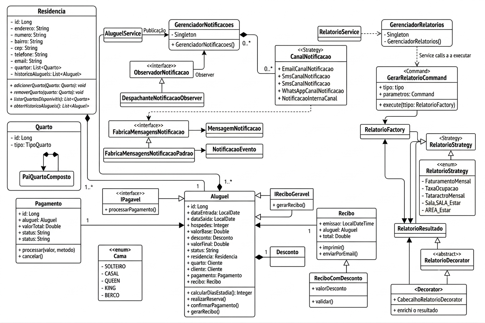
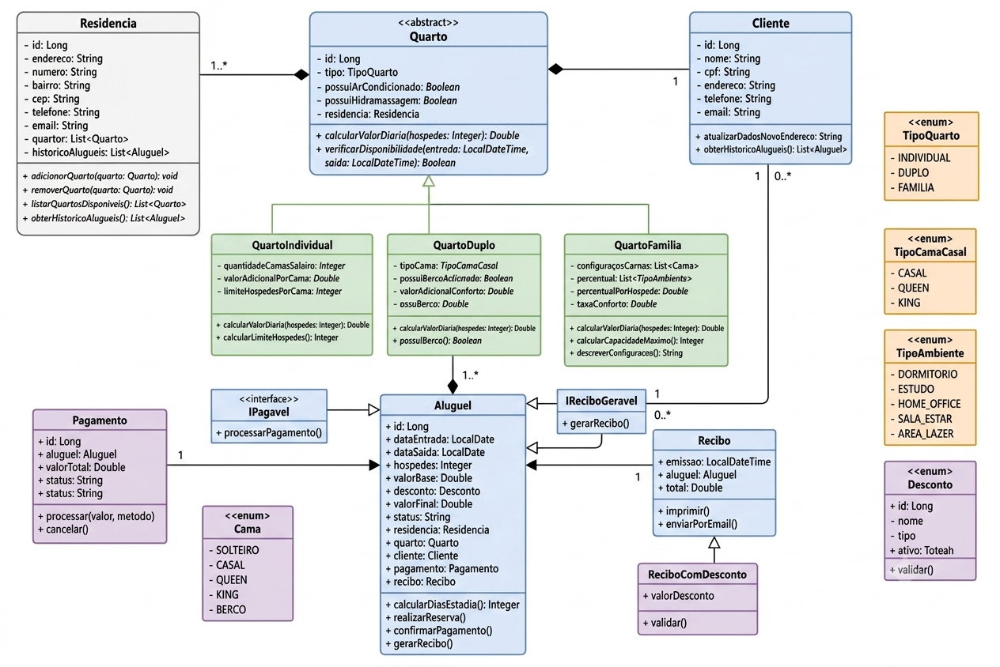

# Sprint 4 — Relatório Técnico

**Disciplina:** Programação Modular  
**Projeto:** Sistema de Hospedagem MaraúReserve  

**Funcionalidades escolhidas:**
- **Opção 3** — Central de Notificações *(implementada)*
- **Opção 5** — Relatórios Gerenciais *(implementada)*

---

## Introdução

Nesta sprint, o grupo evoluiu a arquitetura do **MaraúReserve** aplicando padrões de projeto (GoF) para ampliar as capacidades da aplicação, mantendo extensibilidade e facilidade de manutenção. Foram implementadas duas funcionalidades do enunciado:

| Opção | Funcionalidade | Padrões aplicados |
|-------|----------------|-------------------|
| **3** | Central de Notificações | Observer, Strategy, Factory, Singleton |
| **5** | Relatórios Gerenciais | Strategy, Factory, Command, Decorator, Singleton |

O requisito obrigatório de **Singleton** foi atendido em componentes que representam recursos globais (`GerenciadorNotificacoes`, `GerenciadorRelatorios` e `ConfiguracaoReservas`), sem ser o único padrão adotado na sprint.

---

## Diagramas UML

A modelagem desta sprint é apresentada em **dois diagramas de classes** (visão consolidada) e em **diagramas Mermaid** (visão técnica alinhada ao código).

### Diagrama 1 — Domínio e integração com padrões (Sprint 4)

Representa o domínio do sistema e a integração das novas funcionalidades (notificações e relatórios) com as classes existentes, destacando os padrões de projeto aplicados.



**Elementos principais:**
- **Opção 3:** `GerenciadorNotificacoes` (Singleton), `ObservadorNotificacao`, `CanalNotificacao`, `FabricaMensagensNotificacao`
- **Opção 5:** `GerenciadorRelatorios` (Singleton), `GerarRelatorioCommand`, `RelatorioFactory`, `RelatorioStrategy`, `RelatorioDecorator`
- **Integração:** `AluguelService` publica eventos no gerenciador de notificações; relatórios consultam `AluguelRepository` sem acoplar o domínio

### Diagrama 2 — Modelo de domínio (sprints anteriores)

Apresenta a modelagem orientada a objetos do núcleo do sistema (residências, quartos, clientes, aluguéis), servindo de **contexto** para as evoluções da Sprint 4.



### Diagramas técnicos (Mermaid)

Para detalhamento por pacote, relações UML (generalização, composição, dependência) e diagramas de sequência, consulte [sprint4-diagramas.md](sprint4-diagramas.md).

### Nota sobre diagrama × implementação

Os diagramas PNG possuem **caráter conceitual e integrador**, úteis para visualizar o sistema como um todo. A implementação atual do backend segue o código-fonte em `back/src/main/java`, com algumas simplificações em relação ao diagrama de domínio, por exemplo:

- `Quarto` é modelado como **entidade única** com enum `TipoQuarto` (não como hierarquia de subclasses)
- Confirmação de pagamento é feita via campo `pagamentoConfirmado` em `Aluguel` (sem entidade `Pagamento` separada)
- `RelatorioStrategy` é **interface** com seis implementações em `reports.impl` (não enum)

O documento [sprint4-diagramas.md](sprint4-diagramas.md) reflete fielmente a estrutura implementada e deve ser usado como referência técnica complementar.

### Mapa consolidado — padrão × classe

| Padrão | Opção 3 — Notificações | Opção 5 — Relatórios |
|--------|------------------------|----------------------|
| **Singleton** | `GerenciadorNotificacoes` | `GerenciadorRelatorios` |
| **Observer** | `ObservadorNotificacao`, `DespachanteNotificacaoObserver` | — |
| **Strategy** | `CanalNotificacao` (+ 4 canais) | `RelatorioStrategy` (+ 6 strategies) |
| **Factory** | `FabricaMensagensNotificacao` | `RelatorioFactory` |
| **Command** | — | `GerarRelatorioCommand` |
| **Decorator** | — | `RelatorioDecorator`, `CabecalhoRelatorioDecorator` |

---

# Parte I — Opção 3: Central de Notificações

## 1. Problema identificado

Antes da evolução arquitetural, o `AluguelService` concentra apenas regras de negócio de reservas. Se a lógica de notificação fosse adicionada diretamente nesse serviço, ocorreriam os seguintes problemas:

1. **Alto acoplamento** — cada nova operação (criar, cancelar, check-in) precisaria conhecer todos os canais de envio;
2. **Baixa extensibilidade** — incluir um novo canal (ex.: push notification) exigiria alterar múltiplos pontos do código;
3. **Responsabilidade única violada** — o serviço de aluguel passaria a cuidar de persistência, validações e comunicação;
4. **Dificuldade de manutenção** — mudanças em mensagens ou canais impactariam o núcleo do domínio.

## 2. Solução proposta e padrões utilizados

A solução utiliza os padrões: **Observer**, **Strategy**, **Factory** e **Singleton**.

### 2.1 Observer (Observador)

**Onde:** pacote `notifications.observer`

**Componentes:**
- `ObservadorNotificacao` — interface do observador
- `DespachanteNotificacaoObserver` — observador concreto que reage aos eventos
- `GerenciadorNotificacoes.publicar()` — notifica todos os observadores registrados

**Como foi usado:**

Quando o `AluguelService` conclui uma operação (ex.: criar reserva), ele publica um `NotificacaoEvento` no gerenciador. Os observadores registrados são notificados automaticamente, sem que o serviço conheça os detalhes do envio.

```java
gerenciadorNotificacoes.publicar(new NotificacaoEvento(TipoEventoNotificacao.RESERVA_CRIADA, salvo));
```

**Justificativa:** o Observer desacopla quem **gera** o evento de quem **reage** a ele. Novos observadores (ex.: auditoria, métricas) podem ser registrados sem alterar o `AluguelService`.

### 2.2 Strategy (Estratégia)

**Onde:** pacote `notifications.strategy`

**Componentes:**
- `CanalNotificacao` — interface comum (`enviar`, `getNome`)
- `EmailCanalNotificacao`, `SmsCanalNotificacao`, `WhatsAppCanalNotificacao`, `NotificacaoInternaCanal` — estratégias concretas

**Como foi usado:**

O `DespachanteNotificacaoObserver` monta as mensagens e delega o envio ao gerenciador, que percorre todos os canais registrados:

```java
for (CanalNotificacao canal : canais) {
    canal.enviar(mensagem);
}
```

**Justificativa:** cada canal possui regras próprias de entrega. O Strategy permite adicionar novos canais implementando a interface, respeitando o princípio Aberto/Fechado (OCP), sem modificar o código existente.

### 2.3 Factory (Fábrica)

**Onde:** pacote `notifications.factory`

**Componentes:**
- `FabricaMensagensNotificacao` — interface da fábrica
- `FabricaMensagensNotificacaoPadrao` — implementação que monta mensagens para cliente e proprietário

**Como foi usado:**

O `DespachanteNotificacaoObserver` delega a criação das mensagens à fábrica, que encapsula títulos, conteúdo e destinatários conforme o tipo de evento:

```java
for (MensagemNotificacao mensagem : fabricaMensagens.criarMensagens(evento)) {
    gerenciador.enviarPorCanais(mensagem);
}
```

**Justificativa:** centraliza a lógica de construção das mensagens e evita que observadores e canais conheçam os detalhes de formatação de cada evento.

### 2.4 Singleton

**Onde:** `GerenciadorNotificacoes`

**Como foi usado:**

Classe com construtor privado, instância única via `getInstance()` e double-checked locking para thread-safety. Centraliza:

- registro de observadores;
- registro de canais;
- publicação de eventos;
- histórico de notificações internas.

**Justificativa da instância única:**

A Central de Notificações é um **recurso global** da aplicação. Manter uma única instância garante que todos os serviços publiquem eventos no mesmo barramento, que os canais sejam registrados uma única vez na inicialização e que o histórico interno seja consistente em toda a aplicação.

## 3. Eventos e canais implementados

### Eventos suportados

| Evento | Gatilho no sistema |
|--------|-------------------|
| `RESERVA_CRIADA` | Criação de um novo aluguel/reserva |
| `RESERVA_CANCELADA` | Cancelamento de reserva |
| `CHECKIN_REALIZADO` | `POST /alugueis/{id}/check-in` |
| `CHECKOUT_REALIZADO` | `POST /alugueis/{id}/check-out` |
| `PAGAMENTO_CONFIRMADO` | `POST /alugueis/{id}/confirmar-pagamento` |

### Canais de comunicação

| Canal | Implementação |
|-------|---------------|
| E-mail | `EmailCanalNotificacao` |
| SMS | `SmsCanalNotificacao` |
| WhatsApp | `WhatsAppCanalNotificacao` |
| Notificação interna | `NotificacaoInternaCanal` (histórico consultável via API) |

### Endpoints relacionados

- `GET /notificacoes` — lista notificações internas registradas
- `GET /notificacoes/evento/{tipo}` — filtra por tipo de evento

## 4. Fluxo de execução

```text
1. Cliente cria reserva via POST /alugueis
2. AluguelService valida, persiste e chama publicarEvento()
3. GerenciadorNotificacoes notifica DespachanteNotificacaoObserver
4. Observer usa FabricaMensagensNotificacao (Factory) para montar mensagens
5. GerenciadorNotificacoes envia por todos os canais (Strategy)
6. NotificacaoInternaCanal registra no histórico
7. GET /notificacoes retorna registros para consulta
```

## 5. Benefícios obtidos

| Benefício | Descrição |
|-----------|-----------|
| **Extensibilidade** | Novos canais = nova classe `CanalNotificacao` |
| **Manutenibilidade** | Mensagens centralizadas na Factory (`FabricaMensagensNotificacaoPadrao`) |
| **Desacoplamento** | `AluguelService` não conhece e-mail, SMS ou WhatsApp |
| **Testabilidade** | Testes em `GerenciadorNotificacoesTest` |
| **Consistência** | Singleton garante ponto único de publicação e histórico |

## 6. Como demonstrar

1. Subir a aplicação (`docker-compose up` ou Spring Boot local).
2. Criar uma reserva: `POST /alugueis`.
3. Consultar notificações: `GET /notificacoes`.
4. Executar check-in: `POST /alugueis/{id}/check-in`.
5. Confirmar pagamento: `POST /alugueis/{id}/confirmar-pagamento`.
6. Cancelar reserva: `POST /alugueis/{id}/cancelar`.
7. Verificar logs do backend (canais E-mail, SMS e WhatsApp simulados via SLF4J).
8. Rodar testes: `mvn test` no módulo `back`.

---

# Parte II — Opção 5: Relatórios Gerenciais

## 1. Problema identificado

Os proprietários precisam acompanhar o desempenho do negócio por meio de relatórios gerenciais (faturamento, ocupação, clientes frequentes, etc.). Sem uma arquitetura adequada, cada novo relatório tenderia a:

1. **Duplicar lógica** — consultas, agregações e formatação repetidas em controllers ou services distintos;
2. **Acoplar relatórios ao restante do sistema** — alterações em um relatório poderiam impactar outros;
3. **Dificultar extensão** — adicionar um novo tipo de relatório exigiria modificar código já existente;
4. **Concentrar responsabilidades** — serviços de domínio (ex.: `AluguelService`) passariam a conhecer detalhes de apresentação e exportação de dados.

## 2. Solução proposta e padrões utilizados

A solução utiliza **Strategy**, **Factory**, **Command**, **Decorator** e **Singleton**, organizados no pacote `reports/`.

### 2.1 Strategy (Estratégia)

**Onde:** pacote `reports` e `reports.impl`

**Componentes:**
- `RelatorioStrategy` — interface comum (`getTipo`, `gerar`)
- Implementações concretas em `reports.impl`

**Estratégias implementadas:**

| Tipo | Classe | Descrição |
|------|--------|-----------|
| `FATURAMENTO_MENSAL` | `FaturamentoMensalStrategy` | Receita agrupada por mês/ano |
| `TAXA_OCUPACAO` | `TaxaOcupacaoStrategy` | Percentual de ocupação por quarto |
| `CLIENTES_FREQUENTES` | `ClientesFrequentesStrategy` | Ranking de clientes por reservas |
| `QUARTOS_MAIS_ALUGADOS` | `QuartosMaisAlugadosStrategy` | Ranking de quartos por aluguéis |
| `RECEITA_POR_TIPO_QUARTO` | `ReceitaPorTipoQuartoStrategy` | Receita agrupada por `TipoQuarto` |
| `HISTORICO_RESERVAS` | `HistoricoReservasStrategy` | Listagem consolidada com filtros |

**Como foi usado:**

Cada relatório encapsula sua consulta e regras de agregação. A strategy é selecionada em tempo de execução conforme o tipo solicitado, sem alterar o controller ou o serviço consumidor.

**Justificativa:** o Strategy permite adicionar novos relatórios implementando a interface e registrando a estratégia na factory, respeitando o princípio Aberto/Fechado (OCP).

### 2.2 Factory (Fábrica)

**Onde:** `RelatorioFactory`

**Componentes:**
- `RelatorioFactory` — registra todas as `RelatorioStrategy` injetadas pelo Spring e resolve a estratégia pelo tipo

**Como foi usado:**

```java
RelatorioStrategy estrategia = relatorioFactory.criar("FATURAMENTO_MENSAL");
return estrategia.gerar(parametros);
```

**Justificativa:** centraliza o registro e a resolução das estratégias, evitando `if/switch` espalhados em controllers e services.

### 2.3 Command (Comando)

**Onde:** pacote `reports.command`

**Componentes:**
- `GerarRelatorioCommand` — encapsula tipo do relatório e mapa de parâmetros (filtros)
- `executar(RelatorioFactory)` — delega à factory e retorna os dados calculados

**Como foi usado:**

O `RelatorioService` cria um comando e o `GerenciadorRelatorios` o executa:

```java
GerarRelatorioCommand command = new GerarRelatorioCommand(tipo, parametros);
return gerenciador.executar(command);
```

**Justificativa:** desacopla quem solicita o relatório (controller/API) da lógica de execução, facilitando extensão futura (filas, auditoria, histórico de comandos).

### 2.4 Decorator (Decorador)

**Onde:** pacote `reports.decorator`

**Componentes:**
- `RelatorioResultado` — estrutura com `tipo`, `titulo`, `geradoEm` e `dados`
- `RelatorioDecorator` — classe base abstrata
- `CabecalhoRelatorioDecorator` — adiciona título e data de geração ao resultado

**Como foi usado:**

Após a strategy calcular os dados, o gerenciador monta um `RelatorioResultado` base e aplica o decorator de cabeçalho:

```java
Object dados = command.executar(relatorioFactory);
RelatorioResultado base = new RelatorioResultado(command.getTipo(), dados);
return new CabecalhoRelatorioDecorator(base).decorar();
```

A API retorna um objeto JSON estruturado (`tipo`, `titulo`, `geradoEm`, `dados`). O frontend extrai o campo `dados` em `api.js` para manter compatibilidade com a tela `Relatorios.jsx`.

**Justificativa:** enriquece a apresentação do relatório sem alterar as classes de cálculo de cada strategy.

### 2.5 Singleton

**Onde:** `GerenciadorRelatorios`

**Como foi usado:**

Classe anotada com `@Component`, inicializada uma única vez pelo Spring e acessível via `getInstance()`. Centraliza:

- execução de comandos;
- aplicação do decorator;
- delegação à `RelatorioFactory` para listagem de tipos disponíveis.

**Justificativa da instância única:**

O gerenciador de relatórios é um **recurso global** da aplicação. Uma única instância garante registro consistente das estratégias e ponto central de execução em toda a aplicação.

> O enunciado da sprint cita explicitamente o **Gerenciador de relatórios** como exemplo válido de aplicação do padrão Singleton.

## 3. Relatórios e endpoints implementados

| Relatório | Endpoint | Parâmetros opcionais |
|-----------|----------|----------------------|
| Tipos disponíveis | `GET /relatorios` | — |
| Faturamento mensal | `GET /relatorios/faturamento-mensal` | `ano` |
| Taxa de ocupação | `GET /relatorios/taxa-ocupacao` | `dataInicio`, `dataFim` |
| Clientes frequentes | `GET /relatorios/clientes-frequentes` | `limite` |
| Quartos mais alugados | `GET /relatorios/quartos-mais-alugados` | `limite` |
| Receita por tipo de quarto | `GET /relatorios/receita-por-tipo-quarto` | — |
| Histórico de reservas | `GET /relatorios/historico-reservas` | `dataInicio`, `dataFim`, `clienteId`, `quartoId` |

Documentação interativa disponível em `/swagger-ui.html` (tag **Relatórios**).

## 4. Fluxo de execução

```text
1. Proprietário acessa a tela Relatórios no frontend (módulo host)
2. Frontend chama GET /relatorios/{tipo} via api.js
3. RelatorioController delega ao RelatorioService
4. RelatorioService cria GerarRelatorioCommand (Command)
5. GerenciadorRelatorios.executar() (Singleton) invoca o command
6. RelatorioFactory resolve a RelatorioStrategy correta (Factory + Strategy)
7. Strategy consulta AluguelRepository e retorna dados agregados
8. CabecalhoRelatorioDecorator enriquece o resultado (Decorator)
9. API retorna RelatorioResultado; frontend usa campo dados para renderização
```

## 5. Benefícios obtidos

| Benefício | Descrição |
|-----------|-----------|
| **Extensibilidade** | Novo relatório = nova `RelatorioStrategy` registrada automaticamente na Factory |
| **Organização** | Command encapsula solicitações; Singleton centraliza execução |
| **Manutenibilidade** | Cada relatório isolado em sua própria classe em `reports.impl` |
| **Apresentação flexível** | Decorator adiciona cabeçalho sem mudar o núcleo de cálculo |
| **Desacoplamento** | `AluguelService` e demais serviços de domínio não conhecem detalhes dos relatórios |
| **Testabilidade** | Testes unitários em `RelatorioFactoryTest`, `GerarRelatorioCommandTest`, `GerenciadorRelatoriosTest` e `FaturamentoMensalStrategyTest` |

## 6. Como demonstrar

1. Subir a aplicação (`docker-compose up` ou Spring Boot local na porta 8081).
2. Cadastrar reservas/aluguéis via `POST /alugueis` (ou usar dados do seeder).
3. Listar tipos disponíveis: `GET /relatorios`.
4. Consultar relatórios individualmente, por exemplo:
   - `GET /relatorios/faturamento-mensal`
   - `GET /relatorios/taxa-ocupacao`
   - `GET /relatorios/clientes-frequentes?limite=5`
5. Acessar o frontend como anfitrião e abrir a página **Relatórios** (`Relatorios.jsx`).
6. Navegar pelas abas (Faturamento, Ocupação, Clientes, etc.) e validar gráficos/tabelas.
7. Conferir no Swagger a resposta JSON com `titulo`, `geradoEm` e `dados`.
8. Rodar testes do módulo: `mvn test` no diretório `back` (inclui testes em `reports/`).


# Requisito obrigatório — Uso de Singleton na Sprint

Conforme exigido pelo enunciado, o padrão Singleton é utilizado em componentes que representam recursos globais do sistema:

| Componente | Funcionalidade | Status |
|------------|----------------|--------|
| `ConfiguracaoReservas` | Configurações globais de reservas (Sprint anterior) | Implementado |
| `GerenciadorNotificacoes` | Central de notificações (Opção 3) | Implementado |
| `GerenciadorRelatorios` | Central de relatórios gerenciais (Opção 5) | Implementado |

O Singleton **não é o único padrão** adotado na sprint: ele complementa Observer, Strategy e Factory na Central de Notificações (Opção 3), e complementa Strategy, Factory, Command e Decorator nos Relatórios Gerenciais (Opção 5).

---

## Benefícios obtidos com a nova arquitetura

A evolução arquitetural da Sprint 4 trouxe ganhos concretos para o MaraúReserve:

| Dimensão | Antes | Depois |
|----------|-------|--------|
| **Notificações** | Lógica de envio acoplada ao serviço de aluguel | Barramento central (Observer + Singleton) com canais plugáveis (Strategy) |
| **Mensagens** | Formatação espalhada | Factory centraliza títulos, conteúdo e destinatários |
| **Relatórios** | Risco de duplicação em controllers | Cada relatório isolado em Strategy; Factory resolve o tipo |
| **Solicitações** | Controller conheceria detalhes de execução | Command encapsula tipo e filtros |
| **Apresentação** | Dados brutos da consulta | Decorator enriquece com cabeçalho sem alterar cálculos |
| **Extensibilidade** | Alterações em cascata | Novo canal, observador ou relatório = nova classe + registro |
| **Manutenção** | Alto acoplamento | Responsabilidades separadas por pacote (`notifications.*`, `reports.*`) |
| **Qualidade** | Cobertura limitada | Testes unitários nos módulos de notificações e relatórios |

Em conjunto, os padrões adotados permitem que o sistema **creça por extensão** (novas classes) em vez de **modificação** (alteração de código existente), alinhando-se ao princípio Aberto/Fechado (OCP) e às boas práticas de orientação a objetos exigidas na disciplina.

---

## Equipe

- Ítalo Eduardo Carneiro da Silva
- Guilherme Augusto Martins de Carvalho
- Luca Moreira Ribeiro Mazala de Araujo
- João Victor Leite Soares
